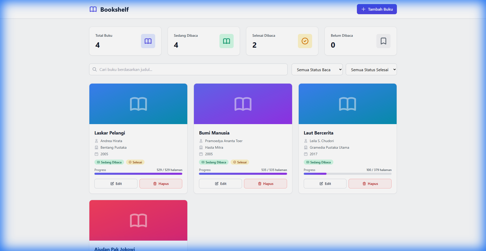
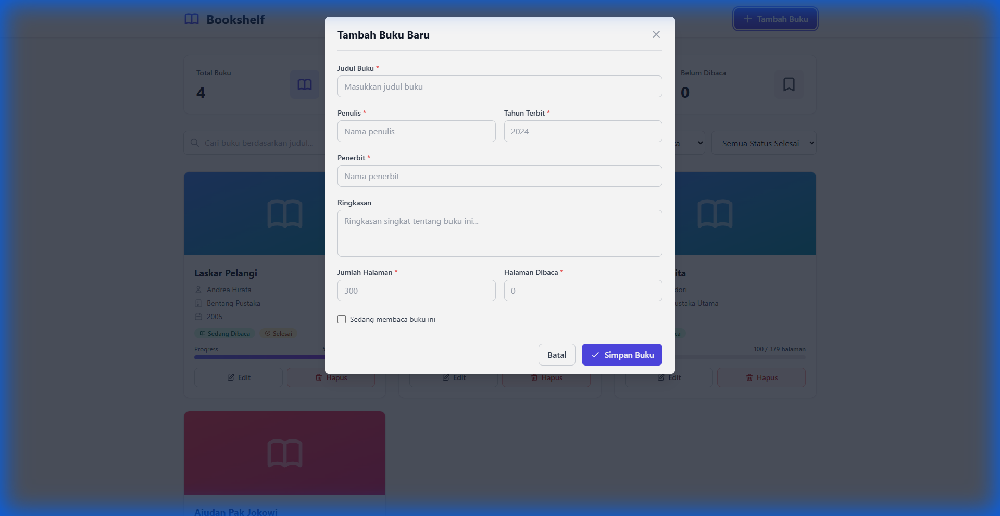
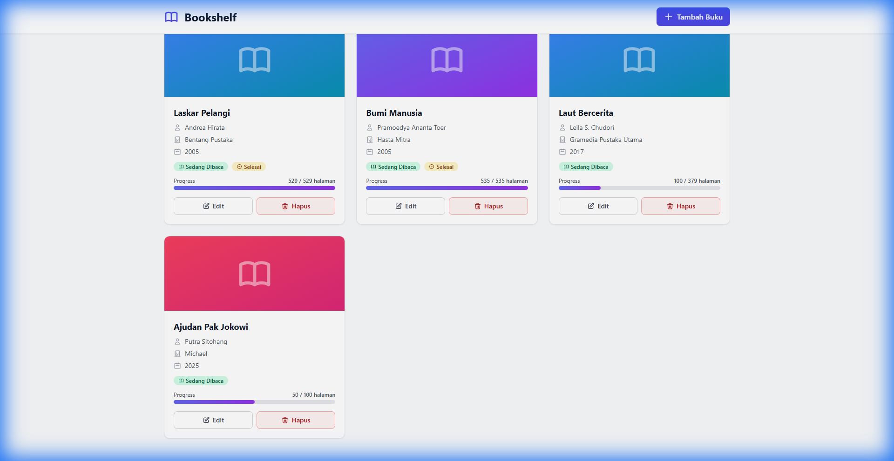
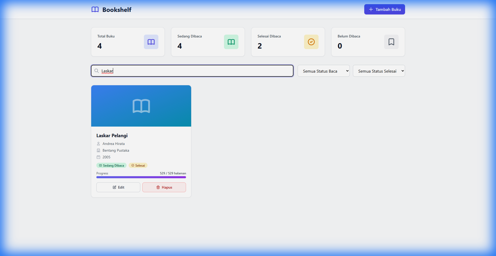

# 📚 Bookshelf API

API sederhana untuk mengelola data buku dengan frontend modern menggunakan TailwindCSS. Dibuat untuk submission Dicoding - Belajar Membuat Aplikasi Back-End untuk Pemula.



## ✨ Features

### Backend (Hapi.js)
- ✅ **CRUD Operations** - Create, Read, Update, Delete buku
- ✅ **Search & Filter** - Cari berdasarkan nama, filter by reading/finished status
- ✅ **Validation** - Input validation dengan error handling
- ✅ **CORS Enabled** - Siap untuk frontend integration

### Frontend (TailwindCSS + Vanilla JavaScript)
- ✅ **Modern UI** - Professional design dengan TailwindCSS
- ✅ **Heroicons** - SVG icons yang clean dan modern
- ✅ **Responsive** - Mobile-friendly design
- ✅ **Real-time Search** - Instant filtering dengan debouncing
- ✅ **Toast Notifications** - User feedback yang jelas
- ✅ **Form Validation** - Real-time validation

---

## 📸 Screenshots

### Homepage dengan Statistik

*Dashboard dengan statistik real-time dan book grid*

### Tambah Buku

*Form modal untuk menambah buku baru dengan validation*

### Book Cards

*Card design dengan gradient covers, progress bars, dan status badges*

### Search Feature

*Real-time search functionality*

---

## 🚀 Cara Menjalankan

📖 **[Lihat Panduan Lengkap](CARA_MENJALANKAN.md)** untuk instruksi detail step-by-step.

### Quick Start

**1. Install dependencies:**
```bash
npm install
```

**2. Jalankan backend server:**
```bash
npm run start
```

Atau untuk development mode (auto-restart):
```bash
npm run start-dev
```

Server akan berjalan di `http://localhost:9000`

**3. Jalankan Frontend:**

Pilih salah satu cara:
- **Cara termudah:** Double-click file `frontend/index.html`
- **Live Server:** Gunakan Live Server extension di VS Code
- **HTTP Server:** `http-server -p 8080` di folder frontend

Lihat [Frontend README](frontend/README.md) untuk detail lebih lanjut.

---

## 📡 API Endpoints

### Books

| Method | Endpoint | Description |
|--------|----------|-------------|
| `POST` | `/books` | Menambah buku baru |
| `GET` | `/books` | Mendapatkan semua buku |
| `GET` | `/books/{bookId}` | Mendapatkan detail buku |
| `PUT` | `/books/{bookId}` | Mengubah data buku |
| `DELETE` | `/books/{bookId}` | Menghapus buku |

### Query Parameters (GET /books)

- `?name={string}` - Filter berdasarkan nama buku (case insensitive)
- `?reading={0|1}` - Filter berdasarkan status reading
- `?finished={0|1}` - Filter berdasarkan status finished

**Contoh:**
```
GET /books?name=Laskar&reading=1
GET /books?finished=1
```

---

## 📦 Tech Stack

### Backend
- **Framework:** @hapi/hapi v21.4.4
- **ID Generator:** nanoid v3.3.11
- **Linting:** ESLint v8.57.1
- **Dev Tools:** nodemon v3.1.11

### Frontend
- **CSS Framework:** TailwindCSS v3.4 (CDN)
- **Icons:** Heroicons (SVG)
- **JavaScript:** Vanilla ES6+
- **API Client:** Fetch API

---

## 📁 Struktur Project

```
Bookshelf API/
├── src/
│   ├── server.js          # Server utama
│   ├── handler.js         # Handler untuk API endpoints
│   ├── routes.js          # Definisi routes
│   └── books.js           # Data storage (array)
├── frontend/
│   ├── index.html         # Halaman utama
│   ├── js/
│   │   ├── app.js         # Logic utama & API integration
│   │   ├── components.js  # UI components
│   │   └── utils.js       # Helper functions
│   └── README.md          # Dokumentasi frontend
├── screenshots/           # Screenshot untuk dokumentasi
├── package.json           # Dependencies
├── CARA_MENJALANKAN.md    # Panduan lengkap
└── README.md              # Dokumentasi ini
```

---

## 🎯 Fitur Unggulan

### 1. **Real-time Statistics**
Dashboard menampilkan statistik yang update otomatis:
- Total buku
- Buku yang sedang dibaca
- Buku yang sudah selesai
- Buku yang belum dibaca

### 2. **Advanced Search & Filter**
- Search real-time dengan debouncing (500ms)
- Filter berdasarkan status reading
- Filter berdasarkan status finished
- Kombinasi multiple filters

### 3. **Modern UI/UX**
- TailwindCSS untuk styling yang konsisten
- Heroicons SVG untuk icons yang crisp
- Smooth animations dan transitions
- Toast notifications untuk user feedback
- Loading states dan empty states

### 4. **Form Validation**
- Required field validation
- Real-time validation feedback
- Custom error messages
- Prevent invalid data submission

---

## 💡 Cara Menggunakan

### Tambah Buku Baru
1. Klik tombol **"Tambah Buku"** di header
2. Isi form dengan data buku
3. Klik **"Simpan Buku"**

### Edit Buku
1. Klik tombol **"Edit"** pada card buku
2. Ubah data yang diperlukan
3. Klik **"Update Buku"**

### Hapus Buku
1. Klik tombol **"Hapus"** pada card buku
2. Konfirmasi penghapusan
3. Buku akan dihapus dari daftar

### Cari & Filter Buku
- **Search:** Ketik judul buku di search box
- **Filter Reading:** Pilih status "Sedang Dibaca" atau "Tidak Sedang Dibaca"
- **Filter Finished:** Pilih status "Sudah Selesai" atau "Belum Selesai"

---

## ⚠️ Catatan Penting

- **Data Storage:** Data buku disimpan di **memory** (array), bukan database
- **Data Persistence:** Data akan **hilang** saat server restart
- **CORS:** Sudah dikonfigurasi untuk mengizinkan akses dari frontend
- **Port:** Backend berjalan di port 9000 (dapat diubah di `src/server.js`)

---

## 🛠️ Development

### Menjalankan ESLint
```bash
npx eslint src/
```

### Testing API dengan Postman/Thunder Client

**Add Book:**
```json
POST http://localhost:9000/books
Content-Type: application/json

{
  "name": "Laskar Pelangi",
  "year": 2005,
  "author": "Andrea Hirata",
  "summary": "Novel tentang pendidikan",
  "publisher": "Bentang Pustaka",
  "pageCount": 529,
  "readPage": 100,
  "reading": true
}
```

---

## 📝 License

This project is created for educational purposes (Dicoding Submission).

---

## 👨‍💻 Author

Created with ❤️ for Dicoding Submission

---

## 🙏 Acknowledgments

- [Dicoding Indonesia](https://www.dicoding.com/) - Platform pembelajaran
- [Hapi.js](https://hapi.dev/) - Backend framework
- [TailwindCSS](https://tailwindcss.com/) - CSS framework
- [Heroicons](https://heroicons.com/) - Icon library
